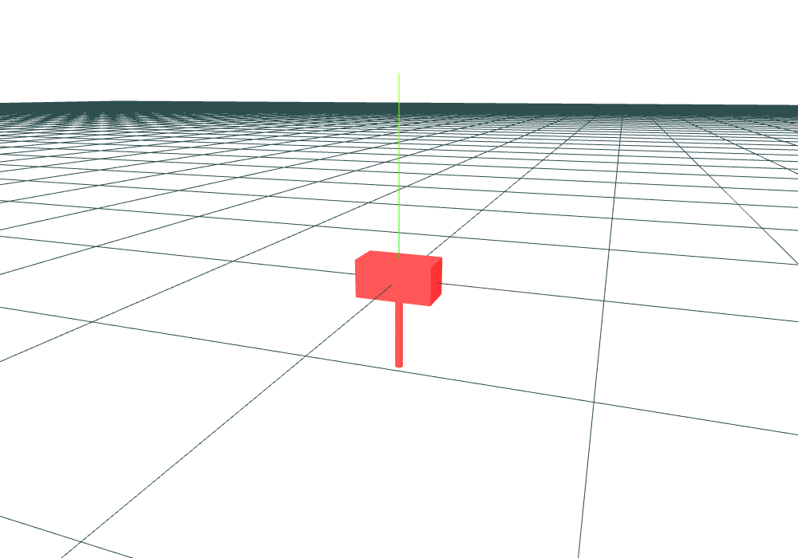

# Applying Lagrangian Mechanics

## Describing Position and Rotation
$\require{mathtools}$
The generalised coordinates of a mass-point with rotation consist of the components of the translation vector and rotation matrix.
A solver like ASC-ODE solves for a matrix that forms the rotation matrix of the body.
Therefore, it needs to ensure that the resulting matrix $B$ actually lies in $SO(3)$.

 - $\bf{det B = 1}$ This has proven to be negligable.
 - $\bf{B}$ **orthonormal** needs to be reformulated into an equation that is easy to check.

\begin{align}
    B ~ \text{orthonormal} \\
    \Leftrightarrow \forall x \in \mathbb{R}^3:~ \| Bx \| & = \| x \| \\
    \Leftrightarrow \forall x \in \mathbb{R}^3:~ \| Bx \|^2 & = \| x \|^2 \\
    \Leftrightarrow \forall x \in \mathbb{R}^3:~ xB^TBx & = x^Tx \\
    \Leftrightarrow B^TB & = I
\end{align}

Therefore, the program only checks whether or not $B^TB = I$.
This can be broken down into 9 scalar equations, one for each compontent of $I$.
However, as $B^TB$ is symmetric {cite}`havl`, the program only needs to check six of these equations.

These generalised coordinates and constraints describe the configuration space of one mass-point with added rotation.


## Kinetic Energy

In order to use the laws of langrangian mechanics, the langrangian function $L = T - V$ of a rigid-body may be set up.
<!-- Let $ U(t)(x) = (t) + R(t) \cdot x \in SE(3) $. (See [](inertiaframes).) -->
```{admonition} TODO
adapt to section on Schöberl's equations
```

### Translation

The translational part of the kinetic energy is given by:
\begin{equation}
    T(v_{trans}) = \frac{1}{2} m v_{trans}^2
\end{equation}
where $v_{trans}$ is the translational part of the velocity and m the mass of the body.
{cite}`theorph{p. 131}`
There also holds $ p_{trans} = m \cdot v_{trans} $, where $p_{trans}$ is the (translational) momentum of the body.

### Rotation

This section covers the calculation of rotational kinetic energy for objects spinning *around their center of mass*,
without translation. It also assumes that the center of mass lies in the center of the body's inertia frame.

Let $V \subseteq \mathbb{R}^3$ be a set representing a body and $\rho(x)$ the density of the body at a point $x \in V$.
Let the angular velocity of the body be given by $v_{rot} \in \mathbb{R}^3$.
Assume that the body only rotates around it's center of mass (no translation) and that $V$ and $v_{rot}$ are in the body's system of inertia.
Then the kinetic energy of this motion fulfills
\begin{equation}
    T(v_{rot}) = \frac{1}{2} \int_V \rho(x)~ | v_{rot} \times x |^2 dx
               = \frac{1}{2} \int_V \rho(x)~ | \widehat{v_{rot}} x |^2 dx
\end{equation}

If we define $(\cdot, \cdot)$ as
\begin{equation}
    (a, b) \coloneqq \frac{1}{2} \int_V \rho(x)~ (a \times x) \cdot (b \times x) ~ dx
\end{equation}
then one obtains $T(v_{rot}) = (v_{rot}, v_{rot})$.

For an efficient implementation of this scalar product, it's gram matrix is used.
This matrix is called the **inertia tensor** (or moment of inertia tensor):
$\newcommand{\II}[0]{{\mathbb{I}}}$
\begin{equation}
    \II = \begin{pmatrix}
              I_{xx} & I_{xy} & I_{xz} \\
              I_{yx} & I_{yy} & I_{yz} \\
              I_{zx} & I_{zy} & I_{zz}
          \end{pmatrix} \in \mathbb{R}^{3 \times 3}
\end{equation}
It's components $I_{ij}$ are called the *moments of inertia*.
The inertia tensor is not time-dependent.

From the definition of the (symmetric) bilinear form above follows that $\II$ is symmetric.
There also exists a orthonormal basis with respect to which $\II$ is diagonal.
The inertia frame described by this basis is called *principle axis frame*.

{cite}`geomech{chapter 2.1}`

The inertia matrix can be considered invertible:
Assume that it is not invertible. Let $a \neq 0, a \in ker \II$. Then $a$ represents a rotation speed.
Increasing that rotation speed will however not affect the kinetic energy $T = \II \cdot \vrot.

This tensor can be obtained from a library like `netgen.occ` .

### Angular Momentum

In a body's system of inertia, the angular momentum is the derivative of the kinetic energy with respect to the angular velocity:
\begin{align}
    \Pi = \frac{\partial T}{\partial v_{rot}}
        &= \frac{\partial}{\partial v_{rot}} \frac{1}{2} \int_V \rho(x)~ | v_{rot} \times x |^2 dx \\
        &= \int_V \rho(x)~ x \times ( v_{rot} \times x ) dx \\
        &= \left( \int_V \rho(x)~ (|x|I - xx^T) dx \right) \cdot v_{rot} \\
        &= \II \cdot v_{rot}
\end{align}
{cite}`{See}geomech{2.1.30}`

Both the kinetic energy of the rotation and $\| \Pi \|$ are conserved. {cite}`geomech{2.1.33}`

### The Mass Matrix

From the above, two equations on the momentum of a body can be gathered:
\begin{equation}
    p_{trans} = m \cdot v_{trans}
\end{equation}
and
\begin{equation}
    p_{rot} = \II \cdot v_{rot}.
\end{equation}

These can be combined into one matrix equation
\begin{equation}
    \begin{pmatrix}
        p_{trans} \\
        p_{rot}
    \end{pmatrix}
    =
    \begin{pmatrix}
        m \\
         & m \\
         &   & m \\
         &   &   & \Large\II
    \end{pmatrix}
    \cdot
    \begin{pmatrix}
        v_{trans} \\
        v_{rot}
    \end{pmatrix}
\end{equation}
The above block matrix is called the **mass matrix** of the body.

If the mass matrix is denoted by $\bf M$ and $p \coloneqq \begin{pmatrix} p_{trans} \\ p_{rot} \end{pmatrix} $ as well as
$v \coloneqq \begin{pmatrix} v_{trans} \\ v_{rot} \end{pmatrix} $, the equation can be written as $\bf p = M \cdot v$.
The mass matrix is not time-dependent as the inertia tensor and mass do not depent on time.
As the left upper diagonal and $\II$ are invertible, the mass matrix is also invertible.

An object:


and its mass matrix from `netgen.occ`:
\begin{equation}
\begin{pmatrix}
    2.06283 & 0 & 0 & 0 & 0 & 0 \\
    0 & 2.06283 & 0 & 0 & 0 & 0 \\
    0 & 0 & 2.06283 & 0 & 0 & 0 \\
    0 & 0 & 0 & 0.4915 & 1.42185e-19 & 3.65922e-18 \\
    0 & 0 & 0 & 1.42185e-19 & 0.833647 & -1.58022e-17 \\
    0 & 0 & 0 & 3.65922e-18 & -1.58022e-17 & 0.9915
\end{pmatrix}
\end{equation}

Note that the the absolute values of all off-diagonal values lie below the double precision epsilon.

<!--
### The Center of Mass and the Origin of the Inertia System

In all of the above, only rotations around the center of mass were considered.
That is, the center of mass was always assumed to lie in the origin of the body's inertia frame.
This can be easily achieved during the setup of the system.

Otherwise, a rotation around the


```{admonition} TODO
jupyter(lite) example
```
-->

The following is already possible just with kinetic energy:
````{div} full-width
```{dropdown} Jupyterlite
<iframe src="https://triadtitans.github.io/rigid_body_interactive/lab/index.html?path=single_body.ipynb" width=100% height="700"></iframe>
```
````


## Potential Energy

ASC-ODE also implements potential energy.
To account for interactions between bodies, the potential is calculated **globally**.
That is, all potential energies of all bodies are summed up.
Let $q_i \in SE(3)$ represent the transformations of the individual bodies.
Then the result is a scalar-valued potential function
\begin{equation}
    V( q_1, q_2, q_3, ...).
\end{equation}

$V$ is then differenciated with respect to all components of all $q_i$.
As the derivative of the potential is the force, the values of resulting gradient are forces.
These forces act on the component values of the $q_i$ and thus on the transformations of the objects.

ASC-ODE implements simple gravity and spring.

### "Gravity"

A simplified form of gravity can be implemented via a constant force that depends on the mass.
A force that acts homogenously on the body does not influence it's rotation.
Therefore, the body can be seen as a point mass. The bodies can also be treated individually.

Using $F = m \cdot a$, the force on a point mass can be specified as an acceleration vector $a \in \mathbb{R}^3$ and the body mass $m$.
For any given translation vector $x$, the antiderivative or potential of that force is
\begin{equation}
    m \cdot (a \cdot x).
\end{equation}

In ASC-ODE, the mass is automatically calculated and the *negative* acceleration vector can be specified:
`rbs.gravity = (0, 9.81, 0)` for downward force.

````{div} full-width
```{dropdown} Jupyterlite
<iframe src="https://triadtitans.github.io/rigid_body_interactive/lab/index.html?path=hammer.ipynb" width=100% height="700"></iframe>
```
````

### Springs

Let $x_1$, $x_2$ be vectors in the systems of inertia of two different bodies. Their conversion to global coordinates is $U_1(x_1)$ and $U_2(x_1)$, respectively.
Consider these points to be connected by a spring with stiffness $k$, length at rest $l$ and elongation $e = \| U_1(x_1) - U_2(x_2) \| - l$.

Then Hooke's law states that the resulting force is given by $F = k \cdot e$ {cite}`theorph{p. 312}`.
Then the resulting potential is
\begin{equation}
    \frac{k}{2} e^2.
\end{equation}

````{div} full-width
```{dropdown} Jupyterlite
<iframe src="https://triadtitans.github.io/rigid_body_interactive/lab/index.html?path=rbs_fem.ipynb" width=100% height="700"></iframe>
```
````
